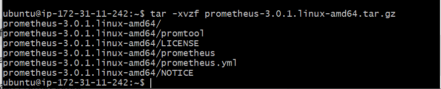
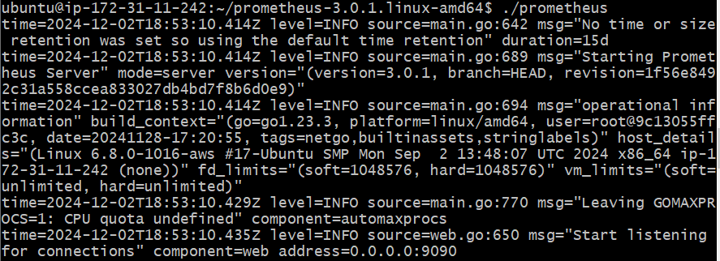
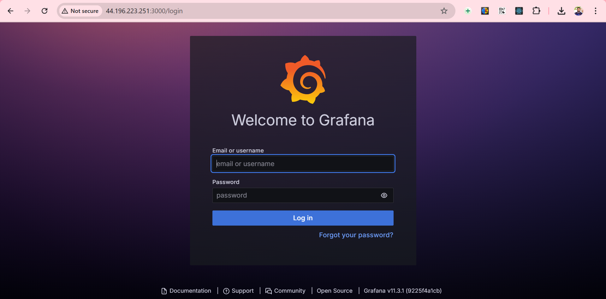
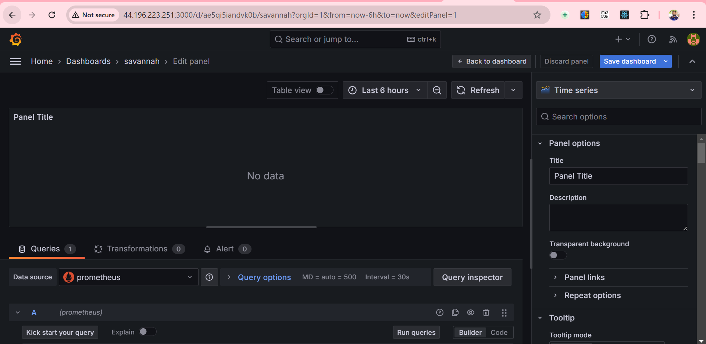

## Task 7: Site Reliability Engineering (SRE)
## Objective
Implement basic SRE principles by monitoring and ensuring the reliability of the deployed web application.

Key Steps:
## Set up monitoring tools (Prometheus and Grafana).
Configure alerts for critical metrics.
Implement basic incident response procedures.
## Step 1: Install Prometheus
## Update System Packages

sudo apt update && sudo apt upgrade -y
## Download Prometheus

wget https://github.com/prometheus/prometheus/releases/download/v2.47.0/prometheus-2.47.0.linux-amd64.tar.gz
## Extract Prometheus

tar -xvf prometheus-2.47.0.linux-amd64.tar.gz
  

## Move Prometheus Files

sudo mv prometheus-2.47.0.linux-amd64 /usr/local/prometheus
## Start Prometheus

cd /usr/local/prometheus
./prometheus --config.file=prometheus.yml
## Verify Prometheus Installation

Open a browser and navigate to http://44.196.223.251:9090.
## Ensure the Prometheus UI is accessible.
Screenshot:
  
*Figure 1: Prometheus installation process.*

## Step 2: Install Grafana
Add Grafana Repository

sudo apt-get install -y software-properties-common
sudo add-apt-repository "deb https://packages.grafana.com/oss/deb stable main"
wget -q -O - https://packages.grafana.com/gpg.key | sudo apt-key add -
Install Grafana

sudo apt-get update
sudo apt-get install grafana -y
Start Grafana

sudo systemctl start grafana-server
sudo systemctl enable grafana-server
Access Grafana

Navigate to http://http://44.196.223.251:3000.
Default login credentials:
Username: admin
Password: admin
  
*Figure 1: Grafana admin login page.*

## Step 3: Configure Prometheus as a Data Source
Add Prometheus Data Source in Grafana

Go to Configuration > Data Sources.
Select Prometheus.
Enter Prometheus URL: http://localhost:9090.
Click Save & Test to validate the connection.
  
*Figure 1: Prometheus data source in.*

## Step 4: Create a Dashboard
Import Dashboard JSON

Go to Dashboards > Import.
Paste the JSON code for the Node.js monitoring dashboard.
Associate it with the Prometheus data source.
Click Import.
Screenshot:

Figure 4: Importing the dashboard JSON.

Verify Metrics

Open the imported dashboard and verify that panels display:
CPU Usage
Memory Usage
HTTP Request Rate
Error Rate
Screenshot:

Figure 5: Monitoring metrics displayed in Grafana.

## Step 5: Configure Alerts
Set Up Alert Rules in Prometheus

## Edit the prometheus.yml file to include alert rules:
yaml

rule_files:
  - "alerts.yml"
Create alerts.yml:
yaml
Copy code
groups:
  - name: Node Alerts
    rules:
      - alert: HighCPUUsage
        expr: node_cpu_seconds_total > 80
        for: 1m
        labels:
          severity: warning
        annotations:
          summary: "High CPU usage detected"
          description: "CPU usage is above 80% for {{ $labels.instance }}"
Screenshot:

Figure 6: Alert rules configuration in Prometheus.

Enable Alertmanager

Start Alertmanager and configure its integration with Prometheus.
Step 6: Verify Alerts
Simulate High CPU Usage

Use a script to generate CPU load:
bash

yes > /dev/null &
Check Alerts in Prometheus

Navigate to Alerts in Prometheus UI.
Verify that the alert is triggered.
Screenshot:

Figure 7: Alert triggered in Prometheus.

Verify Alert Notification in Grafana

Confirm that alert notifications are displayed in the Grafana dashboard.
